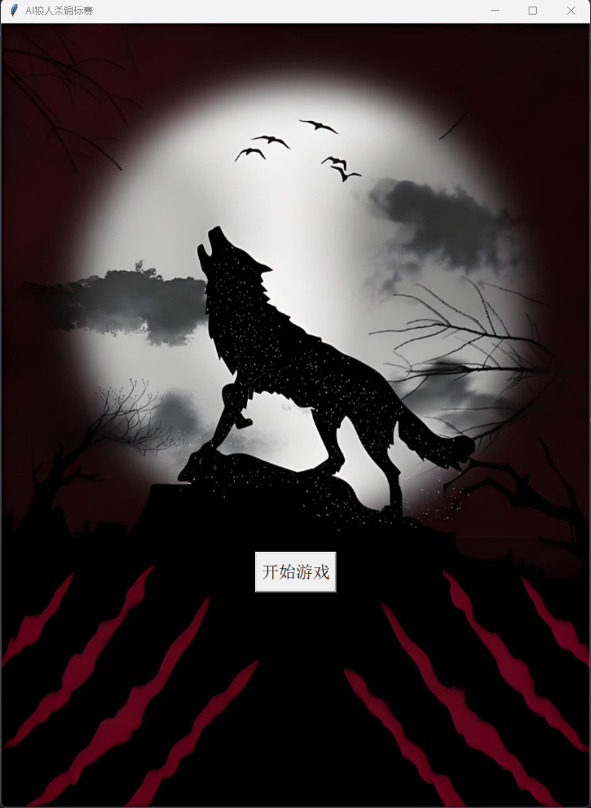
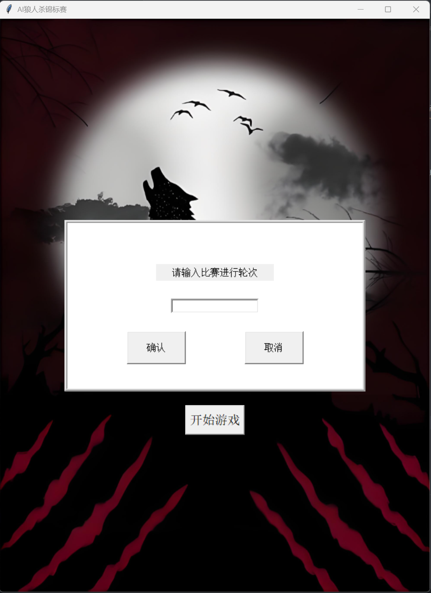
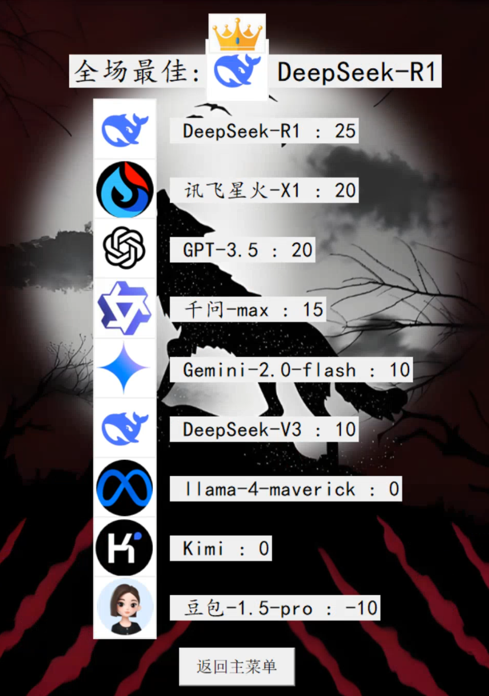

# AI_wolfgame
本项目旨在通过调用大模型“API”，以实现程序控制各个大模型自主完成一场AI狼人杀锦标赛。同时提供了比赛的“积分排名”，用域判定不同智能体在信息不对等情况下的博 弈能力。 在本次多智能体狼人杀实验中，我们构建了由9个AI智能体参与的狼人杀锦标赛，采用标准9人预女猎板子（3狼人、3平民、1预言家、1女巫、1猎人），无警长。狼人阵营 达成屠边胜利条件（即消灭全部神职或全部平民）方可获胜，好人阵营则需清除所有狼人。 每局游戏结束后，获胜阵营全员获得10分基础分，失败不得分。系统同步公开完整游戏信息，由全体AI智能体投票评选本场最佳玩家（MVP）和最差玩家（战犯），MVP额外加5分，战犯扣除5分。用户全程以第三人称视角观战，总游戏轮次由用户预设，最终根据累计 积分评定全场最佳智能体。
## 项目简介

项目 idea 来自于网络博主网页端人工控制的AI狼人杀。

本项目是一个通过调用大模型 `API`，以实现程序控制各个大模型自主完成一场AI狼人杀锦标赛。同时提供了比赛 `积分排名`。

## 基本说明

### 1.游戏说明

我们凑齐了9个 `AI`，开启了一场特殊了 `狼人杀锦标赛`，采用9人预女猎板子(3狼人3平民1预女猎)，无警长。狼人屠边(杀死全部好人/神职)获胜。获胜阵营加`10`分，失败不得分。每场游戏结束后，同步全部信息，由 `AI` 投票选出本场 `MVP` 和 `战犯`。`MVP` 额外加`5`分，`战犯` 额外扣`5`分。总游戏轮次由用户指定，用户全程第三人称视角观战。全部比赛结束后评出 `全场最佳`。

基本规则人人尽知，这里说一下争议性设置。狼人允许自刀，狼人屠边(杀死全部好人/神职)获胜，即使三狼控场不判定为胜利(基本必赢)。猎人被女巫毒死不能发动技能，仅被狼人杀死或在白天被投票处决时可以发动技能带走一人。仅第一天的夜晚死亡可发表遗言，其余夜晚死亡均不能发表遗言。白天被处决一直可以发表遗言。女巫任何时候允许自救(仍有解药时)。每次白天发言顺序为狼人杀死的人的后置位开始，若平安夜，从1号开始。狼人杀人投票平票随机选择，白天弃票过半或平票，无人被处决。

### 2.大模型配置

`main.py` 中的示例大模型配置如下:
1. 豆包-1.5-pro 32K (官方)
2. llama-4-maverick (openrouter平台的免费镜像)
3. gemini-2.0-flash (官方)(需全程"科学上网")
4. deepseek-V3 (官方)
5. 讯飞星火-X1 (官方)(响应速度慢)
6. Kimi-latest (官方)
7. 千问-max-latest (官方)
8. deepseek-R1 (官方)(响应速度慢)
9. GPT-3.5-turbo (免费镜像)(稳定性差)

`demo.py` 中的示例大模型配置均为 deepseek-V3 (openrouter平台的免费镜像)，忽略`UI`界面的显示。

### 3.程序逻辑

#### 3.1文本转语音

定义 `TextToSpeech` 类，该类被声明时直接执行全部中文音色获取(仅执行一次)，内部封装 `speak` 函数，用于语音播报。由于 `edge_tts` 库的特殊性，必须全部采用异步函数。配合 `asyncio` 使用。在 `speak` 函数内部，设置语音获取超时截断和出错截断。于内存中直接播放。选取 `edge_tts` 是基于其音色的多样性和音色的经典性。其余的语音库达不到要求。

#### 3.2大模型智能体

定义 `Agents` 类，该类被声明时基于传入的 `API`、`URL`、`model` 和 `prompt` 进行基本配置，同时定义 `history` 列表，存储所有对话数据，由此引出多轮对话，使大模型智能体能够结合上下文。内部封装 `tell` 和 `chat` 函数。`tell` 函数用于单方面告知大模型信息，不输出回答，即将信息存入 `history`，`chat` 函数将问题传入 `history` 并据此进行对话得到输出，将输出也一并存入 `history`。我们没有外部数据库调用，信息直接写在 `role_prompt` 中直接传给大模型，此处角色为 `system`。由于游戏的特殊性 `tell` 和 `chat` 函数角色为 `user`，这就导致 `user` 信息多于 `assistant`，要求大模型适配这种情况，`腾讯混元` 不支持这一情况，需要注意。

#### 3.3游戏逻辑

定义 `WerewolfGame` 类，为整个项目核心。其同时完成 `UI` 界面的维护和游戏逻辑的进行。`UI` 界面完全基于 `tkinter` 进行开发，`UI` 界面的更新在大多数情况下是伪更新，即删除所有内容并重新部署。该类被声明时，完成 `tkinter` 的宏观基本设置，同时声明 `TextToSpeech` 类，接着进入游戏主菜单。当一场游戏开始后，使用随机数进行身份随机发布，创建 `玩家`，声明 `玩家` 的 `智能体`。同时，设置好游戏进行中的 `UI` 界面。

由于 `tkinter` 的特殊性，不能有耗时操作堵塞主线程，否则 `tkinter` 的 `UI` 界面会得不到维护而无响应。游戏开始后，我们用 `Thread` 开辟第二线程运行游戏逻辑循环(`game_loop`)，所有耗时操作，包括与大模型的 `chat`、播报发言 `speak` 等全部在此线程进行。而主线程负责 `UI` 的维护更新(`updating_UI`)。

`game_loop` 中若游戏未结束，则循环进行 黑天、白天 事件。有结果之后，通过队列 `result_queue` 发送给 `主线程`，`主线程` 根据事件类型进行 `UI` 更新。游戏结束后进行 `MVP` 和 `战犯` 票选，基本逻辑同上述一致。一局游戏彻底完成后再次进入到游戏开始(`start_game`)，进行下一场。直到全部比赛结束，进入结算界面。

## 使用方法

### 1.自定义大模型 API URL model（可选）

首先应当获取希望使用的大模型的 `API` `URL` `model`。需要注意的是，其 `API` 使用方式应当完全适配于 `OpenAI` 架构。若要自定义大模型，可以在 `main.py` 中的 `exsample_Agents` 进行修改替换。当然本项目提供了示例。示例的大模型的 `API` `URL` `model`与本项目 `UI` 设置一致。

### 2.安装依赖

本项目依赖于 `pygame`、`openai`、`asyncio` 和 `edge_tts`，请确保你的 `Python` 环境中已经安装了这些库。

```bash
pip install pygame openai asyncio dege_tts
```

本项目使用微软 `Edge` 文本转语音库，该库为在线服务，请确保 `网络连接正常`。
另外，示例大模型中有 `gemini`，其 `API` 的免费服务地区不包含`中国`，为避免被检测，建议全程 `"科学上网"`。

同时请确保 `main.py`、`demo.py` 和 `pictures` 在同一目录下。

### 3.运行脚本

```bash
python main.py
```

成功运行后会跳出 `tkinter` 的 `UI` 界面，点击 `开始游戏` 跳出比赛设置窗口，可输入希望进行的比赛局数，这里我们控制了 `键盘行为`，仅接受数字、删除、退格、左右输入。输入完成后点击 `确认` 即开始游戏。(无输入点击 `确认` 默认进行一局)





微软 `Edge` 文本转语音库和个别大模型的 `API` 调用有时不稳定。我们提供了 `demo.py`，其完全由 `9` 个 `openrouter` 平台上的免费 `deepseek-V3` 构成，同时删除了文本转语音功能。若 `main.py` 无问题可获得完整体验。

```bash
python demo.py
```

全部比赛结束后会有 `积分总览` 环节。点击 `返回主菜单` 即回到最开始。



演示视频供参考（运行了两局示例。未剪辑，有大量空白时间，注意跳过）


